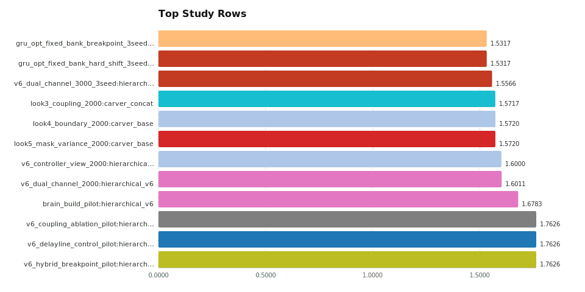

# Public Backlog Report

- root: `/Users/asuramaya/Code/carving_machine_v3/out`
- normalized records: `77`
- bridge rows: `0`
- full eval rows: `0`
- study rows: `77`
- experiment families: `55`

## Headline

- best study quick-check in this backlog: `gru_opt_fixed_bank_breakpoint_3seed` `gru_opt` at `1.531675` `test_mean`

## Survival Pipeline

## Lineage

## Files

- `scan_summary.json`
- `top_full_eval.json` / `top_full_eval.csv` / `top_full_eval.svg`
- `top_bridge.json`
- `top_study.json` / `top_study.csv` / `top_study.svg`
- `survival.json` / `survival.csv` / `survival_status.svg`
- `failed_full_eval.json` / `failed_full_eval.csv`
- `lineage.json`
- `bridge_vs_full_fp16.svg` / `bridge_vs_full_grouped.svg`
- `delta_fp16_histogram.svg`
- `conker7_bridge_fp16.svg`

## Visuals

### Top Study Rows

### Survival Status

### Top Full-Eval Rows

### Bridge vs Full-Eval FP16

### Bridge vs Full-Eval by Family

### Delta Distribution (FP16)

### Conker-7 Bridge Rows

