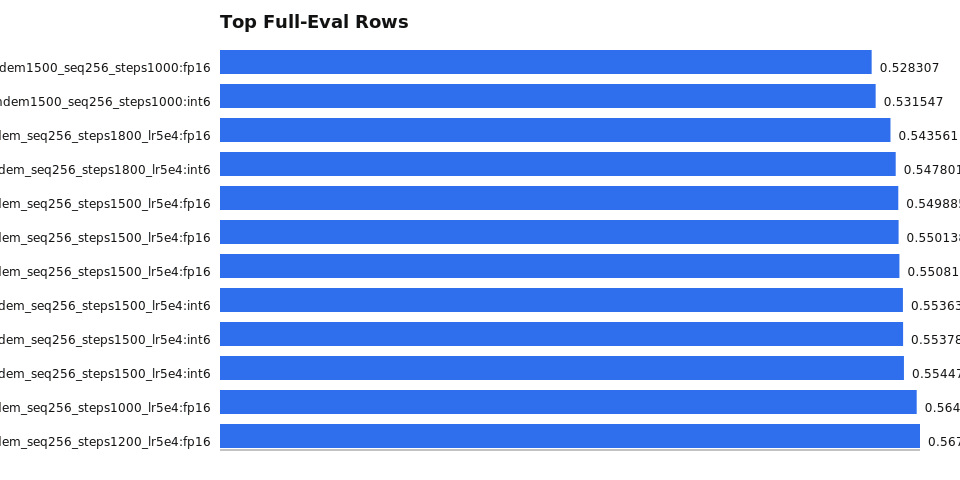
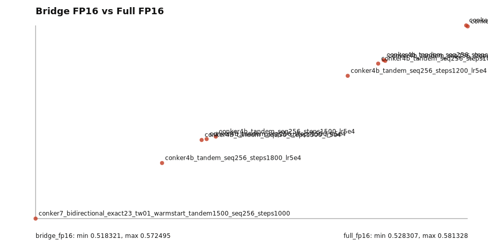
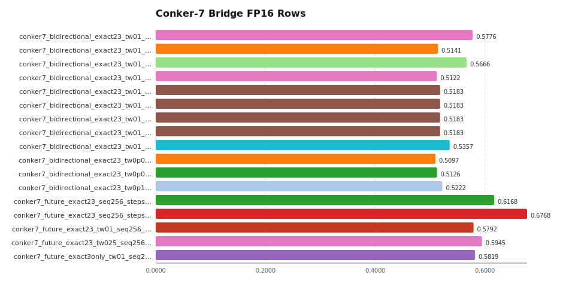

# Public Backlog Report

- root: `conker/out`
- normalized records: `401`
- bridge rows: `366`
- full eval rows: `32`
- study rows: `3`
- experiment families: `229`

## Headline

- best normalized full eval in this backlog: `conker7_bidirectional_exact23_tw01_warmstart_tandem1500_seq256_steps1000` `fp16` at `0.528307 bpb`
- full-eval failures detected after optimistic bridge results: `3`

## Files

- `scan_summary.json`
- `top_full_eval.json` / `top_full_eval.csv` / `top_full_eval.svg`
- `top_bridge.json`
- `survival.json` / `survival.csv` / `bridge_vs_full_fp16.svg`
- `failed_full_eval.json` / `failed_full_eval.csv`
- `lineage.json`
- `conker7_bridge_fp16.svg`

## Visuals

### Top Full-Eval Rows

### Bridge vs Full-Eval FP16

### Conker-7 Bridge Rows

## Failed Full-Eval Rows

- `conker7_bidirectional_exact23_tw01_start500_warmstart_tandem1500_seq256_steps1000` seed `42` bridge fp16 `0.5122250855951872` bridge int6 `0.524202795767721`
- `conker7_bidirectional_exact23_tw0p05_start500_warmstart_tandem1500_seq256_steps1000` seed `42` bridge fp16 `0.5097073605109663` bridge int6 `0.5220992522003182`
- `conker7_bidirectional_exact23_tw0p05_warmstart_tandem1500_seq256_steps1000` seed `42` bridge fp16 `0.5125641658720483` bridge int6 `0.5248642814343933`
